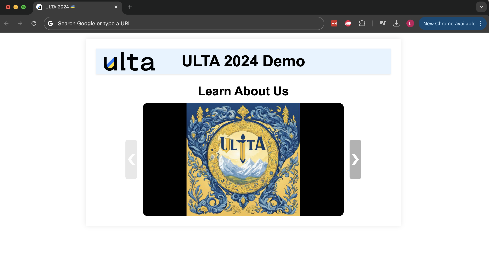

# Making a Website

In this guide we'll walk through the basics of how to set up a _static website_.

See video walkthrough here: [https://www.youtube.com/watch?v=HPPOu3bziOA](https://www.youtube.com/watch?v=HPPOu3bziOA)

The video explains how to purchase a domain and set up DNS routing. Here, we'll assume you already have that figured out.

The three components we'll focus on are HTML, CSS, and JavaScript. Ask your favorite language model for clarification on any points below.

## Let's make a simple demo website

Right now you're all working hard on your projects, but there will come a time when you're done and you need to showcase your great work! Let's build a simple website with a slick nav bar and ULTA logo that will let you display a slide deck showing off the great work you did. To get started, let's use an HTML template that looks like this:

```{HTML}
<!DOCTYPE html>
<html lang="en">
<head>
    <meta charset="UTF-8">
    <meta name="viewport" content="width=device-width, initial-scale=1.0">
    <meta name="description" content="This text will show up as a preview when people search for you on Google.">
    <title>ULTA 2024 🇺🇦</title>

    <style>
    </style>
</head>
<body>
    <div class="container">
        <header>
        </header>
    </div>

    <script src="slides.js"></script>
</body>
</html>
```

If we break down the pieces, there are a few things going on:

1. We're setting some metadata like the scaling properties, description, and title, and later we'll get to another property called the favicon (that little image that shows up on the tab).
2. We're opening an empty `<style>` tag, where later on we'll put our CSS to make our website look snazzy.
3. We're opening an empty `<header>` tag, where we'll put our logo and navigation buttons.
4. We're opening an empty `<div>` tag called container, where we'll put the main content of our website.
5. We're calling a JavaScript file called `slides.js`, which will control the logic of moving forward and backward through our slide deck.

Right now if you opened up the webpage, you wouldn't see much. Let's change that.

### Building the nav bar

First things first, let's insert HTML that describes what we want the nav bar to look like:

```{HTML}
<header>
    
    <div class="project-name">ULTA 2024 Demo</div>
</header>
```

Let's make a file called `logo.jpg` in a folder called `images` so that we can render the ULTA logo.

Inside our `<style>` tag up above, let's add some CSS to make the nav bar look light blue with a slight shadow, centering our project name.

```{CSS}
body {
    margin: 1rem auto;
    padding: 0;
    font-family: Arial, sans-serif;
}
.container {
    max-width: 60%;
    margin: auto;
    padding: 2vw;
    background-color: white;
    box-shadow: 0 0 1vw rgba(0,0,0,0.1);
}
header {
    background-color: #e6f3ff;
    padding: 0.625rem 1.25rem;
    box-shadow: 0 0.125rem 0.25rem rgba(0,0,0,0.1);
    display: flex;
    align-items: center;
    justify-content: space-between;
    position: relative;
}
.logo {
    height: 3.125rem;
    position: absolute;
    left: 1.25rem;
}
.project-name {
    width: 100%;
    font-size: 2.5rem;
    font-weight: bold;
    text-align: center;
}
```

The `rem` unit is an example of a scalable font size unit that adjusts based on screen size and if the user is zoomed in. Let's add some additional structure so that, if the screen size is small (like on mobile), we use a different layout that looks better on smaller screens. Add this to the `<style>` tag:

```{CSS}
/* Rearranges the nav bar for small screens */
@media (max-width: 1200px) {
    header {
        flex-direction: column;
        padding: 0.5rem;
    }
    .logo {
        position: static;
        margin-bottom: 0.5rem;
    }
    .project-name {
        font-size: 2.0rem;
    }
}

/* Rearranges the slide deck for mobile
@media (max-width: 678px) {
    .container {
        max-width: 90%;
    }
}
```

You can do so much with CSS, even animations. But it can be hard to learn it all. I strongly recommend using your favorite language model---especially Claude 3.5 Sonnet is good for this---to help you design your CSS. They know all the tricks and can help guide you to the right design. If they don't get it right the first time, tell them what to change and ask them to iterate.

### Building the slide deck

Now let's show off the project you made in an interactive slide deck widget that we'll program from scratch. The purpose of this section is also to introduce you to how to hook up JavaScript to your website. JavaScript is where you'll handle all the logic behind the scenes. First, let's get in the HTML. Inside the `<div class="container">` tag, let's add this:

```{HTML}
<div class="slide-deck-title">
    <h2>Learn About Us</h2>
</div>
<div class="slideshow-container">
    <div class="slideshow">
        <div class="slide">
            
        </div>
        <button class="nav-button prev-button" disabled="">❮</button>
        <button class="nav-button next-button">❯</button>
    </div>
</div>
```

We're making a big title (that's what the `h2` tag does) and then a container where we'll load the slide image, plus two buttons to navigate forward and backward slides. The back button is disabled to start, since we are on slide 1. I've populated a few slides into the deck as an example. Before we handle the button functionality, let's add some CSS to make the slide deck look nice! Add this to the `<style>` tag:

```{CSS}
.slideshow-container {
    width: 80%;
    height: 50%;
    margin: auto;
    display: flex;
    justify-content: center;
    align-items: center;
}
.slideshow {
    position: relative;
    display: flex;
    justify-content: center;
    align-items: center;
}
.slide {
    width: 85%;
    height: 100%;
    overflow: hidden;
    display: flex;
    justify-content: center;
    align-items: center;
}
.slide img {
    max-width: 100%;
    max-height: 100%;
    border-radius: 0.8vw;
    object-fit: contain;
}
.nav-button {
    position: absolute;
    top: 50%;
    transform: translateY(-50%);
    background-color: rgba(0, 0, 0, 0.3);
    border: none;
    color: white;
    font-size: 3vw;
    padding: 1vw 0.5vw;
    cursor: pointer;
    transition: background-color 0.3s, opacity 0.3s;
    width: 5%;
    height: 8vw;
    display: flex;
    align-items: center;
    justify-content: center;
    border-radius: 0.5vw;
    z-index: 10;
}
.nav-button:hover:not(:disabled) {
    background-color: rgba(0, 0, 0, 0.5);
}
.nav-button:disabled {
    opacity: 0.3;
    cursor: default;
}
.prev-button {
    left: 0;
}
.next-button {
    right: 0;
}
.slide-deck-title {
    text-align: center;
    margin-top: 2vw;
    margin-bottom: 0vw;
}
.slide-deck-title h2 {
    margin-bottom: 1vw;
    font-size: 2rem;
}
```

And inside the `@media (max-width: 678px)` tag to make the experience nice on mobile, add these lines:

```{CSS}
.slideshow-container {
    width: 100%;
    height: 40%;
}
.slide {
    width: 80%;
}
.nav-button {
    font-size: 4vh;
    padding: 4vw 2vw;
    width: 6%;
    height: 12vw;
}
```

Nice! Now the slides look clean.

### Wiring up the buttons

It's time to hook up the buttons to move us forward through the slide deck. We'll do so by creating a script in JavaScript, which is the programming language the web runs on. To save bandwidth, we won't load all the images at the start. Instead, when a user clicks the next button, we'll load the next image on demand. That way our webpage will load more quickly. Here's the JavaScript code we'll use:

```{javascript}
// Slideshow script
const num_slides = 19;
const slides = Array.from({length: num_slides}, (_, i) => `slides/slide_${i + 1}.jpg`);
let currentSlide = 0;

const slideElement = document.querySelector('.slide img');
const prevButton = document.querySelector('.prev-button');
const nextButton = document.querySelector('.next-button');

function loadImage(img, src) {
    img.src = src;
    img.removeAttribute('data-src');
}

function updateSlide() {
    loadImage(slideElement, slides[currentSlide]);
    prevButton.disabled = currentSlide === 0;
    nextButton.disabled = currentSlide === slides.length - 1;
}

function nextSlide() {
    if (currentSlide < slides.length - 1) {
        currentSlide++;
        updateSlide();
    }
}

function prevSlide() {
    if (currentSlide > 0) {
        currentSlide--;
        updateSlide();
    }
}

prevButton.addEventListener('click', prevSlide);
nextButton.addEventListener('click', nextSlide);

// Initial setup
updateSlide();
```

The JavaScript is adding an _event listener_ to the button's `click` attribute. Now when the user clicks the forward or backward button, it calls our custom function. What that function does is load the next image into the `slides` array and then serve that image on to our webpage. Go ahead and play around with the final result!

### Finishing touches

Have you ever heard of a favicon? It's the name of that little image that shows up in the tab on Google Chrome to let you know what website you're on, in addition to the website's title. Let's make a favicon for our website. For this example, I'll use [ULTA's logo](https://ultacademy.org/wp-content/uploads/2023/04/stckr-e1682889672425-300x300.png). To make the favicon, I've gone to [favicon.io](https://favicon.io/favicon-converter/), uploaded the image, and downloaded a zip file with smaller, cropped images that will serve as the favicon. All we have to do now is add the following lines to our `<head>` tag:

```{HTML}
<link rel="apple-touch-icon" sizes="180x180" href="favicon/apple-touch-icon.png">
<link rel="icon" type="image/png" sizes="32x32" href="favicon/favicon-32x32.png">
<link rel="icon" type="image/png" sizes="16x16" href="favicon/favicon-16x16.png">
<link rel="manifest" href="favicon/site.webmanifest">
<link rel="mask-icon" href="favicon/safari-pinned-tab.svg" color="#5bbad5">
<meta name="msapplication-TileColor" content="#da532c">
<meta name="theme-color" content="#ffffff">
```

Now we get that nice logo in our tab bar!

## Conclusion

To sum up, every webpage is built up from HTML (scaffolding what goes on the page), CSS (making things look nice), and JavaScript (handling logic behind the scenes). There are more complicated frameworks like Svelte.js and Tailwind CSS if you're curious for more modern, extensible approaches that go on top of vanilla HTML, CSS, and JavaScript. But even with these building blocks, you can go far. Especially if you are quick to ask for help from your favorite language model---currently, mine is Claude. You can use this template as the starting point, or just inspiration, for the kind of final project website you can build. Don't underestimate the power of color schemes, design, and CSS to make your idea pop. Have fun!

P.S. Here's what our final webpage looks like on my computer:


